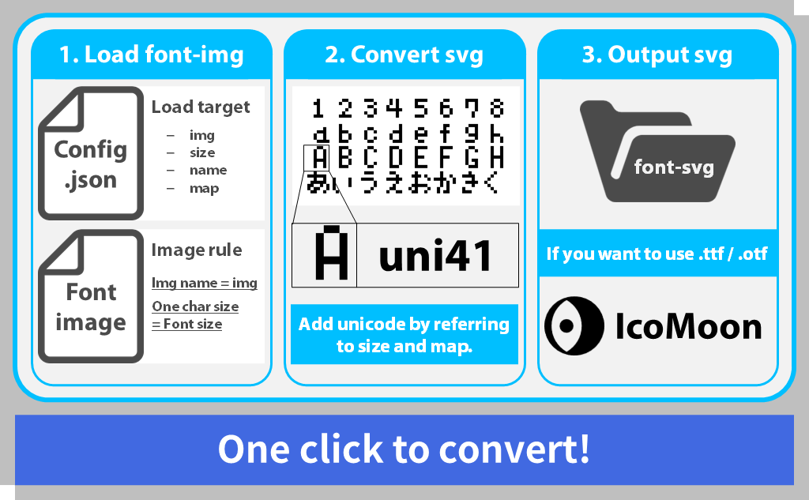
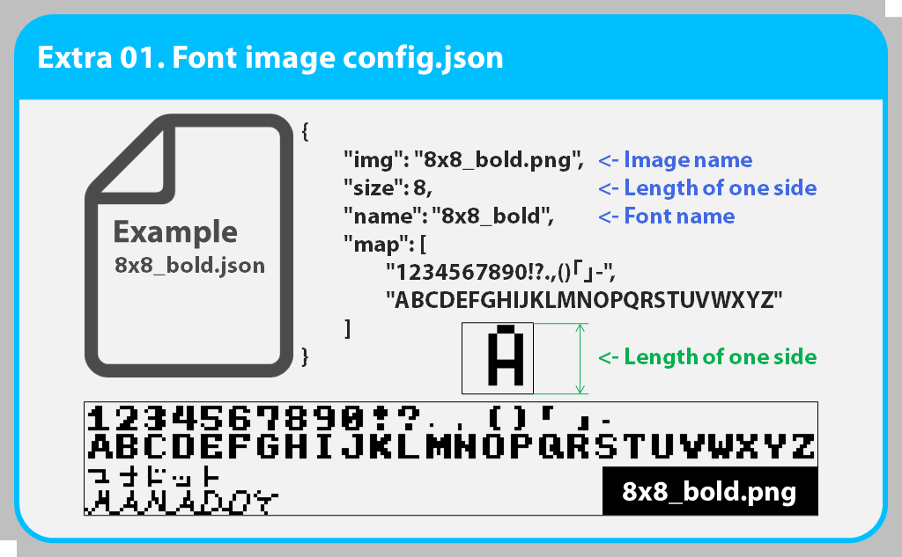
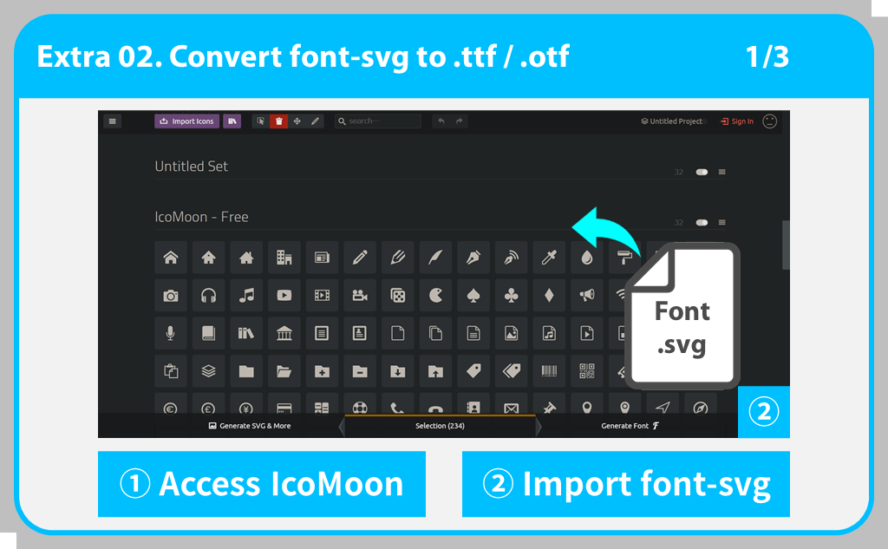
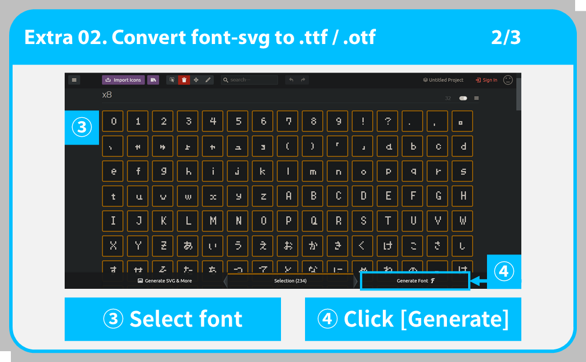
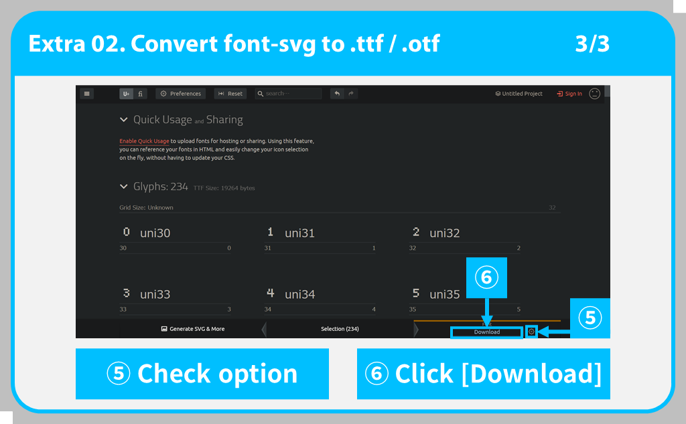

pixel-font-maker
=====

# はじめに
[manaten](https://github.com/manaten) 様の [pixel-font-master](https://github.com/manaten/pixel-font) を元に作成しました。

略儀ながら、ここに感謝の意を表します。

また、pixel-font-master の使い方を知りたい方は上記の他に[こちら](https://blog.manaten.net/entry/pixel-svgfont)もご覧ください。

# 概要
等幅の文字を並べたドット絵画像をsvgフォントに変換します。

convert.bat を実行することで簡単に変換できます。Mac / Linux ユーザーの方は申し訳ありませんが、ご自分で .command / .sh ファイルを作成してください。





# 使い方
convert.bat を実行することで、font-img フォルダーにある pixel-font-img を font-svg に変換します。変換された font-svg は font-svg フォルダーに出力されます。

.ttf ファイルを使用したい場合は [IcoMoonApp](http://icomoon.io/app/#/select) にアクセスして、.svg を変換してください。詳しい方法は [変換方法](##変換方法) をご覧ください。

## 変換方法
<details>
    <summary>こちらをクリックしてください</summary>
    <div>　　



1. [IcoMoonApp](http://icomoon.io/app/#/select) にアクセスしてください。
2. 変換したい font-svg をドラック＆ドロップでインポートしてください。



3. まとめたいフォントを選んでください。
4. フォント選択後、[Generate Font] をクリックしてください。



5. 歯車マークをクリックして、メタ情報などのオプションを編集してください。編集しない場合は、6. へ進んでください。
6. [Download] をクリックして、zip ファイルをダウンロードしてください。
7. ダウンロード後、zip ファイルを解凍すると [font] フォルダに .ttf 形式のフォントファイルがあります。

</div></details>　　

# 環境構築
ソースコードを編集したい方は、下記を参考に環境を構築してください。

<details>
    <summary>こちらをクリックしてください</summary>
    <div>　　

## nodejs 環境構築
Anaconda Ver.
```
# create virtual env
conda create --name nodejs
    - or -
conda create -n coffee

# Active virtual env
conda activate [venv-name]

# install nodejs
conda install -c conda-forge nodejs
```

## 必要なモジュール

* nodejs
* coffeescript
* get-pixels
* xmlbuilder

node.jsを入れた後、```npm install```で必要なパッケージをインストールします。

```
npm install --global coffee-script
npm install -g get-pixels
npm install -g xmlbuilder
```

プロキシ設定が必要な方は、下記を参考に設定してください。
```
# if you need to use proxy, please set proxy setting.
npm config set proxy http://<userid>:<password>@<server-address>:<port>
npm config set https-proxy http://<userid>:<password>@<server-address>:<port>

# example
npm config set proxy http://proxy.example.com:8080
npm config set https-proxy http://proxy.example.com:8080
```

## .coffee / .js 実行
```
# create svg font
coffee index.coffee
    - or -
node index.js

# .coffee -> .js
coffee --compile index.coffee

# .js -> .exe （私は上手くいきませんでした）
C:\Windows\Microsoft.NET\Framework\[.NET_version]\jsc.exe index.js
```

</div></details>　　

# 注意

* convert.bat を実行しても変換できない場合は、お手数ですが[環境構築](##環境構築)を参考に環境を構築し、スクリプトを実行して変換してください。
* Aseprite などで作成したフォント画像を使用する際、その画像を正しく読み取らない場合があります。その時は、8x8 などのデフォルトの画像のコピーを編集することで正しくフォントを認識します。

# 更新情報

* 2021/11/11: <br>
半角・全角ごとにフォントの横幅・縦幅を設定できるようにしました。
* 2021/11/04: <br>
First commit

# 開発者情報

* [Github DriCro6663](https://github.com/DriCro6663)
* [Twitter Dri_Cro_6663](https://twitter.com/Dri_Cro_6663)
* [PieceX DriCro6663](https://www.piecex.com/users/profile/DriCro6663)
* [ドリクロの備忘録](https://dri-cro-6663.jp/)
* dri.cro.6663@gmail.com

# ライセンス

[LICENSE](./LISENCE) ファイルをご確認してください。