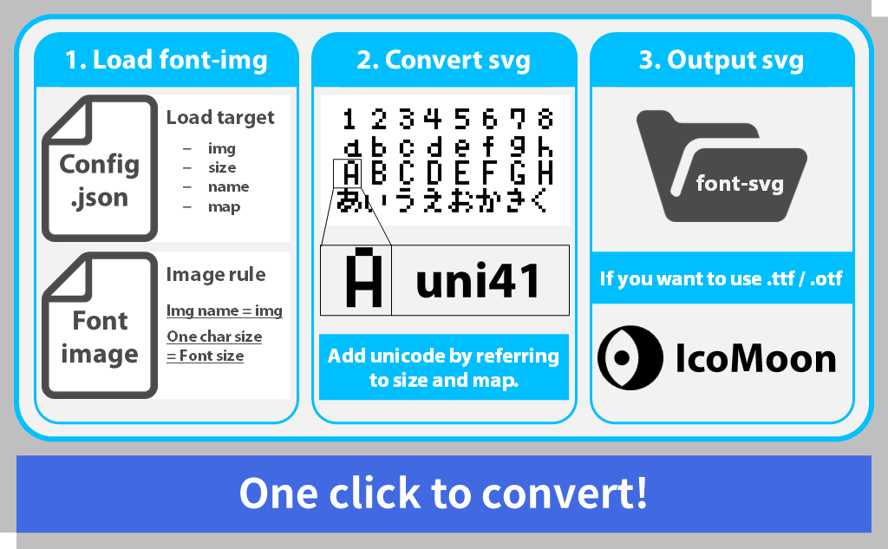
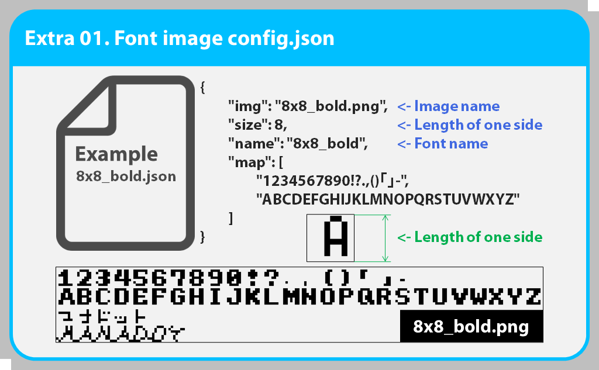

pixel-font-maker
=====

# Introduction

I'm not good at English. There may be parts that are difficult to understand. In that case, please feel free to ask me questions.

Based on [pixel-font-master](https://github.com/manaten/pixel-font) by [manaten](https://github.com/manaten).

I would like to express my gratitude to [manaten](https://github.com/manaten).

Also, if you want to know how to use pixel-font-master, please see [here](https://blog.manaten.net/entry/pixel-svgfont) in addition to the above.

# Overview
This program converts a pixel image of monospaced text into an svg font.

It can be easily converted by running convert.bat, sorry Mac / Linux users, but you will have to create your own .command / .sh files.





# Usage
Execute convert.bat to convert pixel-font-img in the font-img folder to font-svg. The converted font-svg will be output to the font-svg folder.

If you want to use .ttf and .otf files, go to [IcoMoonApp](http://icomoon.io/app/#/select) and convert the .svg files. See [HowToConvert](##HowToConvert) for detailed instructions.

## HowToConvert

<details>
    <summary>Click here</summary>
    <div>　　


1. Go to [IcoMoonApp](http://icomoon.io/app/#/select). 
2. Import the font-svg you want to convert by dragging and dropping it.


3. Select the font you want to put together. 
4. After selecting the font, click [Generate Font].


5. Click on the gear symbol to edit the meta information and other options. If you do not want to edit, go to next step.
6. Click "Download" to download the zip file. 
7. After downloading and unzipping the zip file, you will find the font files in .ttf and .otf format in the [font] folder.

</div></details>　　

# BuildTheEnvironment
If you want to edit the source code, please refer to the following to build the environment.

<details>
    <summary>Click here</summary>
    <div>　　

## nodejs environment setup
Anaconda Ver.
```
# create virtual env
conda create --name nodejs
    - or -
conda create -n coffee

# Active virtual env
conda activate [venv-name]

# install nodejs
conda install -c conda-forge nodejs
```

## Required modules

* nodejs
* coffeescript
* get-pixels
* xmlbuilder

After adding node.js, use ``npm install`` to install the required packages.

```
npm install --global coffee-script
npm install -g get-pixels
npm install -g xmlbuilder
```

If you need proxy settings, please refer to the following.
```
# if you need to use proxy, please set proxy setting.
npm config set proxy http://<userid>:<password>@<server-address>:<port>
npm config set https-proxy http://<userid>:<password>@<server-address>:<port>

# example
npm config set proxy http://proxy.example.com:8080
npm config set https-proxy http://proxy.example.com:8080
```

## Run .coffee / .js
```
# create svg font
coffee index.coffee
    - or -
node index.js

# .coffee -> .js
coffee --compile index.coffee

# .js -> .exe (didn't work for me)
C:\Windows\Microsoft.NET\Framework\[.NET_version]\jsc.exe index.js
```

</div></details>　　

# Note

* If you cannot convert the file by executing convert.bat, please build the environment by referring to [BuildTheEnvironment](#BuildTheEnvironment), and then execute the script to convert the file.

# Developer Information

* [Github DriCro6663](https://github.com/DriCro6663)
* [Twitter Dri_Cro_6663](https://twitter.com/Dri_Cro_6663)
* [PieceX DriCro6663](https://www.piecex.com/users/profile/DriCro6663)
* [Dri-Cro's Memorandum](https://dri-cro-6663.jp/)
* dri.cro.6663@gmail.com

# License

Please check the [LICENSE](./LICENSE) file.